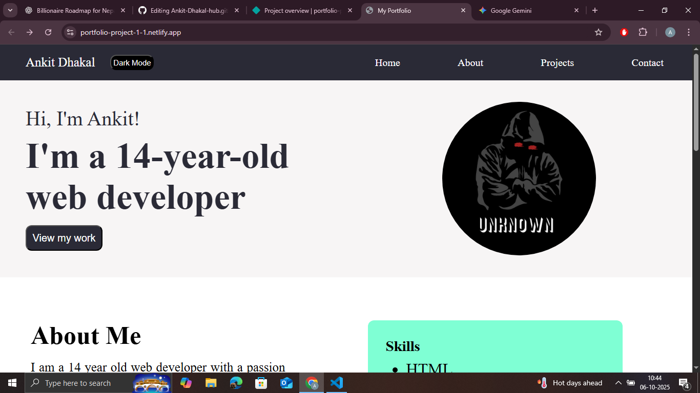

# 🌐 Personal Portfolio Website

This is my **personal portfolio website**, built using **HTML, CSS, and JavaScript**, to showcase my skills, projects, and achievements.  
It reflects my journey as a self-taught developer, my passion for web development, and my growing expertise in building modern, responsive websites.

## 🌟 Features
- Beautiful and responsive UI  
- Sections for About, Projects, Skills, and Contact  
- Dark mode toggle  
- Interactive animations and smooth transitions  
- Built from scratch without any templates  

## 🧰 Tech Stack
- HTML  
- CSS  
- JavaScript  

## 🚀 Live Demo
[👉 View on Netlify](https://portfolio-project-1-1.netlify.app/)

## 📸 Screenshot

## 📩 Contact
If you like my work or want to collaborate, feel free to reach out through the contact form on my site.
